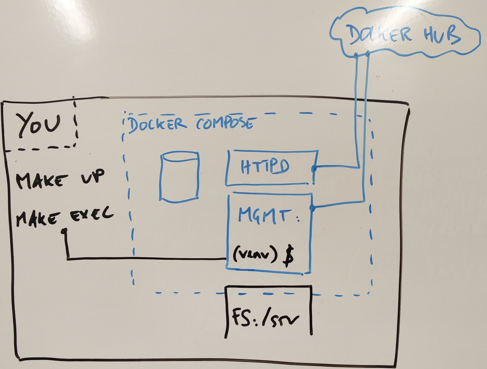
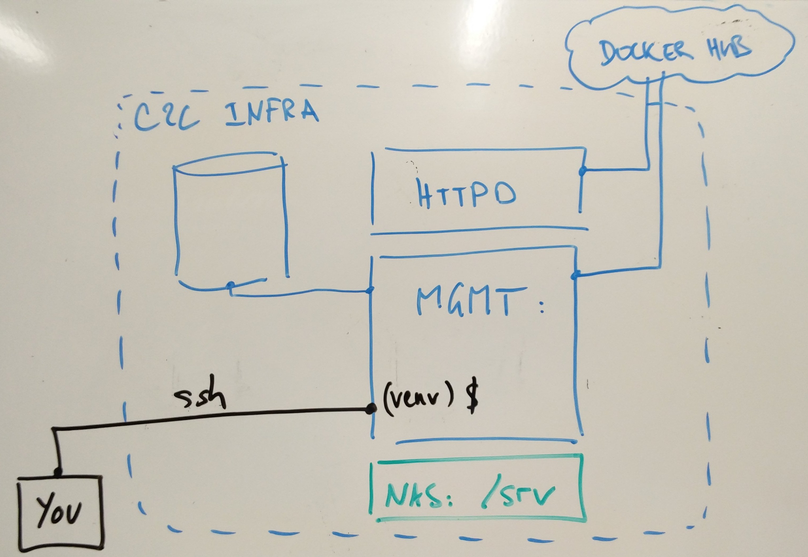

<!-- markdownlint-disable -->
<h1 align="center" style="margin:1em">
  
   
  jahia2wp
</h1>

<h4 align="center">
  Control your migration from Jahia to WordPress
</h4>

  
  
  

 

Table of contents
-----------------

<!-- TOC -->

- [Overview](#overview)
- [License](#license)
- [Install](#install)
    - [Assumptions](#assumptions)
    - [Requirements](#requirements)
    - [Express setup (locally)](#express-setup-locally)
    - [Express setup (C2C)](#express-setup-c2c)
    - [Enter the container](#enter-the-container)
- [Usages](#usages)
    - [Export a Jahia website (zip file)](#export-a-jahia-website-zip-file)
    - [Create a new WordPress site](#create-a-new-wordpress-site)
    - [Information on a WordPress site](#information-on-a-wordpress-site)
    - [Inventory of WordPress sites for a given path (in a given env)](#inventory-of-wordpress-sites-for-a-given-path-in-a-given-env)
    - [Delete a WordPress site](#delete-a-wordpress-site)
    - [phpMyAdmin (locally)](#phpmyadmin-locally)
- [Contribution](#contribution)
    - [Testing](#testing)
    - [Guidelines](#guidelines)
    - [Code of Conduct](#code-of-conduct)
    - [Contributor list](#contributor-list)
- [Roadmap](#roadmap)
- [Changelog](#changelog)

<!-- /TOC -->

## Overview

This repository will provide you with an amazing toolbox to migrate your old beloved Jahia website to a brand new WordPress one.

In the process, not only shall you **not** loose your data, but you shall also be able to control and drive the migration process, i.e:

- where to migrate: URLs of your new site
- what to migrate: all pages? only a group of pages?
- how to migrate: apply some filters to clean your HTML
- for whom to migrate: use gaspar accounts as admins

## License

[MIT license - Copyright (c) EPFL](./LICENSE)

## Install

### Assumptions

You are a developer, with an experience of `git` and `python`.

In this documentation the code snippets will make the assumption that you clone the git repo into '`you@host:~$`'.

When it comes to the environment, we will use the following values in our examples:

- '`your-env`' for the project environment : that's ok for you if you work only locally. You need to use your environment name if you wotk on C2C infra.
- '`venv`' for the python virtual environment : keep this name like this, since some shortcuts (aliases) make use of it.

### Requirements

We have tried (hard) to make this process as smooth as possible, and to isolate most of the dependencies in a `docker` container. However, you still need to install a few things locally (head to [INSTALL_TOOLS.md](./docs/INSTALL_TOOLS.md) to get more details).

Be sure you meet the following requirements:

1. git
1. docker and docker-compose
1. make

Note that python is not in the requirements. You do not necessarily need it on your host since we will rely on docker's version.

### Express setup (locally)

As some commands require `sudo`, you will be asked for your system password. The process will add a line line in your `.bashrc` (again: head to [INSTALL_TOOLS.md](./docs/INSTALL_TOOLS.md) to get more details):

    you@host:~$ git clone git@github.com:epfl-idevelop/jahia2wp.git
    you@host:~$ cd jahia2wp
    you@host:jahia2wp$ make bootstrap-local ( add ENV=your-env if you use a C2C environment name here if you have one)
    ...
    -> instructions to finish local setup

Simply run the instructions given in the last lines from the script.

Among them, `make exec` will log you in your container: you are now ready to jump to the next section, about [usages](#usage).

💡 If you want to use a nonstandard HTTP or HTTP/S port, you will need to [log in through phpMyAdmin](#phpmyadmin-locally) to [edit](https://codex.wordpress.org/Changing_The_Site_URL#Changing_the_URL_directly_in_the_database) `siteurl` in table `wp_options`, **prior to** testing your new site in the browser (or [clear the cache](https://stackoverflow.com/a/46632349/435004) if you forgot)

Did we mention that would you be looking for a more explicit process, feel free to follow the [detailed guide](./docs/INSTALL_DETAILED.md)? ;)

### Express setup (C2C)

You will need to ask C2C to add your public key in `authorized_keys` on the server.

    you@host:~$ export WP_ENV=your-env (<- use your C2C environment name here if you have one)
    you@host:~$ ssh -A -o SendEnv=WP_ENV www-data@exopgesrv55.epfl.ch -p 32222
    
    www-data@mgmt-x-xxx:/srv/your-env$ git clone git@github.com:epfl-idevelop/jahia2wp.git
    www-data@mgmt-x-xxx:/srv/your-env$ cd jahia2wp
    www-data@mgmt-x-xxx:/srv/your-env/jahia2wp$ cp /srv/.config/.env . (<- that will set the correct DB credentials for you)

You are now ready to jump to the next section, about [usages](#usage).

### Enter the container

In this section, we assume that you have been through all [the installation steps](#install), and you now have a bash running in your management container:

    # locally
    you@host:jahia2wp$ make exec
    www-data@xxx:/srv/your-env$

    # C2C infra
    you@host:~$ managwp
    www-data@mgmt-x-xxx:/srv/your-env$

The usage is independent from the environment. The same docker image is used in both case. The difference will come from the variables in the .env file. 

You can start with this useful alias:

    www-data@...:/srv/your-env$ vjahia2wp

The configuration of your python virtual environment will occur the first time you make use of it. Otherwise, it is simply activated and your are correctly set in your `src` dir:

    (venv) www-data@...:/srv/your-env/jahia2wp/src$ 

## Usages

For all examples given in this section, you should have completed the previous section. Therefore, the assumption is made that 

1. you are connected in your `mgmt` container (or in C2C infra),
1. and you used the alias `vjahia2wp` to activate your environment

From here you can use the python script jahia2wp.py. The option `-h` will give you details on available options

    python jahia2wp.py -h

### Export a Jahia website (zip file)

Provided that you have an admin access on Jahia for the website you wish to export, you can download a zip file with the content of your website.

You can set up credentials either through environment variables (e.g in your .env file) or through the command line interface. The zip file will be downloaded in the directory pointed out by `JAHIA_ZIP_PATH` (by default where you execute the command)

    # using credentials from .env
    #   JAHIA_USER = admin
    #   JAHIA_PASSWORD = secret
    #   JAHIA_HOST = localhost
    .../src$ python jahia2wp.py download dcsl
    NFO - your-env - session - http://jahia202.epfl.ch/administration - authenticating...
    INFO - your-env - download_site - saving response into dcsl_export_2017-10-11-11-08.zip...
    INFO - your-env - download_site - file downloaded in 0:00:00.121159

    # using credentials from command line (you will be prompted for password)
    .../src$ python jahia2wp.py download --username=foo
    Jahia password for user 'foo':
    Jahia password for user 'root':
    INFO - your-env - session - http://jahia202.epfl.ch/administration - authenticating...
    INFO - your-env - download_site - saving response into ./dcsl_export_2017-10-11-11-13.zip...
    INFO - your-env - download_site - file downloaded in 0:00:00.121510

### Create a new WordPress site

Here are some examples with WordPress sites at different levels

    .../src$ python jahia2wp.py generate $WP_ENV http://localhost
    .../src$ python jahia2wp.py generate $WP_ENV http://localhost/folder/ --wp-title="Sous Site WP" --owner=235151
    .../src$ python jahia2wp.py generate $WP_ENV http://localhost/folder/niv3 --wp-title="Site Niv3 WP" --admin-password=foo

You can check that three new WordPresses are running on http://[localhost](http://localhost)/[folder](http://localhost/folder)/[niv3](http://localhost/folder/niv3).

You can access the [admin](http://localhost/folder/niv3/wp-admin) of the last one with the credentials `admin/foo`.

### Information on a WordPress site

To check if you have a wordpress properly configured:

    .../src$ python jahia2wp.py check $WP_ENV http://localhost/folder/niv3
    WordPress site valid and accessible at http://localhost/folder/niv3

To get the version of a given wordpress:

    .../src$ python jahia2wp.py version $WP_ENV http://localhost
    4.8

To get the admin users of a given wordpress

    .../src$ python jahia2wp.py admins $WP_ENV http://localhost/folder/
    admin:admin@example.com <administrator>
    user235151:user@epfl.ch <administrator>

### Inventory of WordPress sites for a given path (in a given env)

To look into the tree structure and list all valid/unvalid wordpress sites, with some info when they are valid:

    .../src$ python jahia2wp.py inventory $WP_ENV /srv/your-env/localhost
    INFO - your-env - inventory - Building inventory...
    path;valid;url;version;db_name;db_user;admins
    /srv/your-env/localhost/htdocs/;ok;http://localhost/;4.8.2;wp_dvyrgdywryrcmnkjnmonfzjv9ts4d;ce8clbbqyzeqta31;admin
    /srv/your-env/localhost/htdocs/folder;ok;http://localhost/folder;4.8;wp_snqi7wekjznhkfe1ggisr9jmqaqeo;o0ajktkeaygim7w9;admin
    /srv/your-env/localhost/htdocs/unittest;KO;;;;;
    INFO - your-env - inventory - Inventory made for /srv/your-env/localhost

### Delete a WordPress site

To delete the sites created in the previous section, you could do

    python jahia2wp.py clean $WP_ENV http://localhost/folder/niv3
    python jahia2wp.py clean $WP_ENV http://localhost
    python jahia2wp.py clean $WP_ENV http://localhost/folder/

### phpMyAdmin (locally)

A phpMyAdmin is available locally at [localhost:8080](http://localhost:8080), with the server and credentials defined in your .env file

## Contribution

There are a few ways where you can help out:

1. Submit [Github issues](https://github.com/epfl-idevelop/jahia2wp/issues) for any feature enhancements, bugs or documentation problems.
1. Fix open issues by sending PRs (please make sure you respect [flake8](http://flake8.pycqa.org/en/latest/) conventions and that all tests pass (see below)
1. Add documentation (written in [markdown](https://daringfireball.net/projects/markdown/))

### Testing

You can launch the tests either from your host:

    you@host:~/jahia2wp$ make test
    ...

Or from the management container:

    (venv) www-data@...:/srv/your-env/jahia2wp/src$ pytest
    ...

    (venv) www-data@...:/srv/your-env/jahia2wp/src$ cd .. 
    (venv) www-data@...:/srv/your-env/jahia2wp$ make test-raw
    ...

### Guidelines

### Code of Conduct

As detailed in [CODE_OF_CONDUCT.md](./docs/CODE_OF_CONDUCT.md), we pledge to making participation in our project and our community a harassment-free experience for everyone

### Contributor list

Big up to all the following people, without whom this project will not be

| | | |  |  |  | |
| :---: | :---: | :---: | :---: | :---: | :---: | :---: |
| [ Manu B.](https://github.com/ebreton)  | [ Manu J. ](https://github.com/jaepetto)  | [ Greg](https://github.com/GregLeBarbar)  | [ Lulu](https://github.com/LuluTchab)  | [ Laurent](https://github.com/lboatto)  | [ Luc](https://github.com/lvenries)  |   | 
| [ Dominique](https://github.com/domq)  | [ Nicolas ](https://github.com/ponstfrilus)  | [ CampToCamp](https://github.com/camptocamp)  |   |   | |   |   | 

## Roadmap

We will first focus on automation and maintenance, with the objective of driving all the creation process from one shared spreadsheet (aka configuration source).

1. installing a functional WordPress to any given URL
1. configuring the website with supported plugins and the EPFL theme
1. applying those first two steps to every row of our configuration source
1. maintaining the website and the plugins

We will secondly add support for migration of a simple site:

1. Jahia text boxes, to WordPress pages
1. translation, hierarchy, sidebar

And lastly we will extend the support to other Jahia boxes, mainly thanks to WordPress shortcodes

- people, faq, actu, memento, infoscience, and so on ...

## Changelog

All notable changes to this project are documented in [CHANGELOG.md](./CHANGELOG.md).
